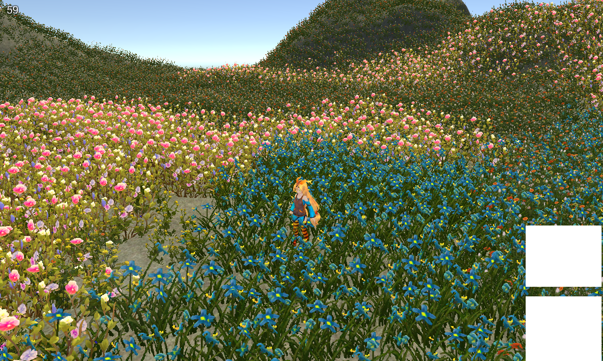

简介
====
可用在Unity项目的可交互的草，会在进入场景时将Unity原生的草替换成自己生成的Mesh
[Android版Demo](/demo.apk)


如何使用
====
1.在地形上添加TerrainGrassManager组件
2.在需要扰动草的物体上（如主角）添加TerrainGrassCollider组件，并设置manager属性
3.在需要额外添加扰动的时候（如释放技能时）调用TerrainGrassManager的AddDisturbance函数

内部实现方式
====
1.草的生成
----
1.在启动时，会读取地形上刷的DetailLayer的数据，根据这些数据知道哪里需要创建多少棵草，然后创建Mesh
2.通过将Terrain上Detail Distance设置为0的方法，将Unity原生的草隐藏

2.添加扰动
----
1.每当有新的扰动需要添加的时候（如角色移动距离超过阈值，或者释放技能时），会更新一次网格，其他时候不会更新
2.再更新网格时会记录开始时间（即更新网格的时间），shader中根据当前时间和开始时间来计算扰动角度并随时间衰减。

3.草的渲染
----
1.在创建Mesh的时候，会在顶点的Tangant属性里保存扰动的相关信息（扰动初始值、最大值、开始时间、最大值时间四个Float）
2.在渲染Vertex Shader中根据这四个之和当前时间计算草叶倾倒程度
```c
//tangent.x 初始值，即更新网格时候的值，因为可能上次扰动还没有结束，所有开始值有可能不为0
//tangent.y 最大值，即倾倒角度到达最大的值，受扰动力量和距离扰动中心的距离影响
//tangent.z 开始时间，即更新网格的时间
//tangent.w 到达最大值得时间
float Simulate(float4 tangent, float time)
{
	if (time < tangent.w) {//上升期
		float t = (time - tangent.z) / (tangent.w - tangent.z);
		return lerp(tangent.x, tangent.y, pow(t,0.5));
	}
	else {
		float duration = 4;//下降时长
		float t = (time - tangent.w) / (duration);
		return lerp(tangent.y, 0, t);
	}
}
```

3.将计算出的倾倒角度与绕垂直轴的旋转进行叠加，得到草的最终朝向，并更新Mesh
4.按照普通的Pixel Shader进行渲染。